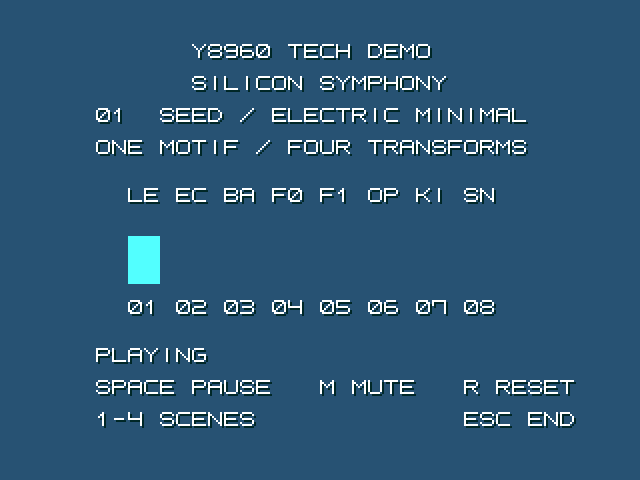

[日本語](README.ja.md)

# y8960-tech-demo

A full playthrough captured in openMSX (about 33 seconds; GIF has no audio).

**SILICON SYMPHONY** is an original, approximately 32-second sound demo for the Y8960-enabled openMSX fork. One melody grows from SSG into stereo counterpoint, dual OPLL and OPL2 bass with synthesized ADPCM percussion. Four sections repeat automatically.

This is an independent demo, not an official openMSX or Y8960 project. Version **0.5.0**.

## Run

Windows 10/11 x64. Extract the whole package into a writable local folder outside cloud sync.

1. Double-click **setup-y8960.bat**. Wait for the hash and startup checks.
2. Double-click **launch-y8960-tech-demo.bat**.

The runtime uses C-BIOS and a normal V9958 display. No proprietary BIOS, V9968, z88dk or Python is required to play. All settings stay in this project's runtime directory.

Use the `y8960-tech-demo-0.5.0.zip` asset from [GitHub Releases](https://github.com/renatus-xxxx/y8960-tech-demo/releases), rather than GitHub's automatically generated “Source code (zip)”. Setup requires an internet connection.

## What the setup BAT does

`setup-y8960.bat` runs the included PowerShell script.

1. Check that Windows is 64-bit and the local folder has no links or reparse points; create a log and a lock against simultaneous setup runs.
2. Check the demo ROM's SHA-256. For a new installation, download the pinned emulator ZIP using curl.exe, or reuse and verify the cached archive.
3. Verify the ZIP's SHA-256, extract it into staging, and check the openmsx.exe hash.
4. Start C-BIOS, the demo ROM and Y8960 without screen or audio output; check demo initialization and the expected sound devices.
5. Move the successful installation into runtime and record managed file hashes. On failure, clean up the staging environment and retain logs.

On subsequent runs, setup verifies the existing runtime without reinstalling it or resetting user settings. It does not compile sources or run detailed audio measurements. Use the launch BAT to play. The PowerShell execution-policy option applies only to the launched process and does not change the system policy.

## Controls

| Key | Action |
|---|---|
| 1–4 | Jump to a section; automatic playback then continues |
| Space | Pause/resume the musical timeline |
| M | Mute/unmute while the timeline continues |
| R | Restart from section 1 |
| Esc | Silence all used voices and stop; close the window to exit |

Section 1: SSG lead. Section 2: second SSG echo and bass. Section 3: two OPLL circuits and chord voices. Section 4: OPL2 bass plus two ADPCM percussion voices.

Bars show **note activity**, not measured audio amplitudes or an FFT. LE=lead, EC=echo, BA=SSG bass, F0/F1=OPLL, OP=OPL2 bass, KI=kick, SN=snare. The music and generated percussion are original. Musical settings are editable in Python/C; reading a score is not required.

## Help

- Missing runtime: run setup first.
- Hash mismatch: do not bypass it; restore the matching archive/files.
- No sound: check the Windows application volume and M key; the fork uses the Y8960 output rather than the built-in MSX output.
- Re-running setup verifies managed files and retains user settings. A different version requires a fresh extraction folder.
- To reset settings, close openMSX and remove `runtime/user`. To uninstall, close openMSX and remove this project's folder. Nothing is installed globally.
- Errors are recorded in `logs` or `runtime/user/stderr.log`.

See [development, sources and limitations](docs/development.md) and [verification](docs/verification.md).

## Technical guide

Japanese and English guides, each 30 pages, cover sound control, music data, ADPCM generation, rendering, setup and verification.

See also [audio-first updates and automated dropout tests](docs/development.md#audio-first-updates-and-automated-tests).

- [PDF (Japanese)](docs/technical/Y8960-TECH-DEMO-technical.ja.pdf)
- [PDF (English)](docs/technical/Y8960-TECH-DEMO-technical.en.pdf)

## Credits

Y8960 hardware/specifications: HRA!; initial emulator work: buppu3; extended fork: madscient. Setup organization follows [openmsx-v9968-windows-setup](https://github.com/renatus-xxxx/openmsx-v9968-windows-setup).

Demo C/Python/scripts and original music: MIT. openMSX, its bundled components and C-BIOS retain their own licenses; this repository's MIT license does not replace them. The demo uses **MSX 8x8 font by 1re1**. Thank you for making this font available. See [font sources and usage terms](third-party/fonts/README.md). The display combines a blue background with a one-pixel drop shadow offset down and to the right.

[Third-party components and terms](docs/licenses.md)
